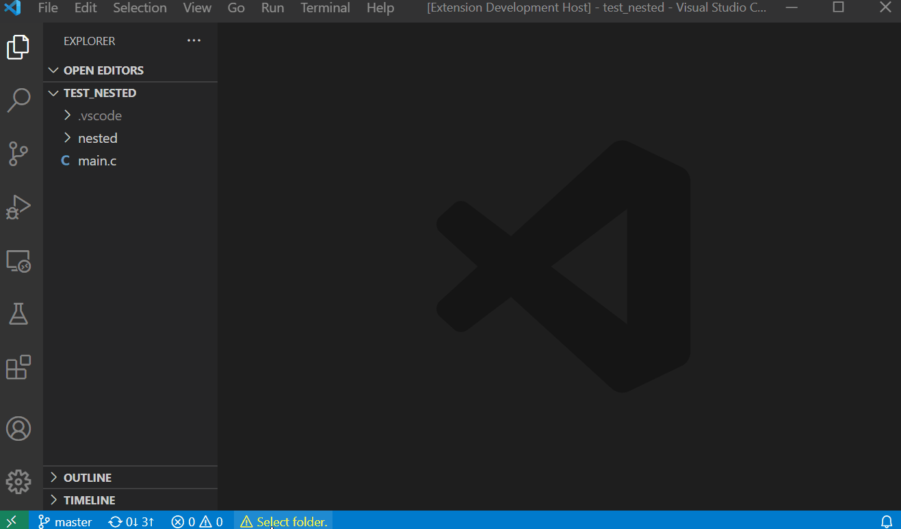

# A C++ template on Gitpod

This is a [C++](https://clang.llvm.org/) template configured for ephemeral development environments on [Gitpod](https://www.gitpod.io/).

## Next Steps

Click the button below to start a new development environment:

## Get Started With Your Own Project

## Run/Debug

